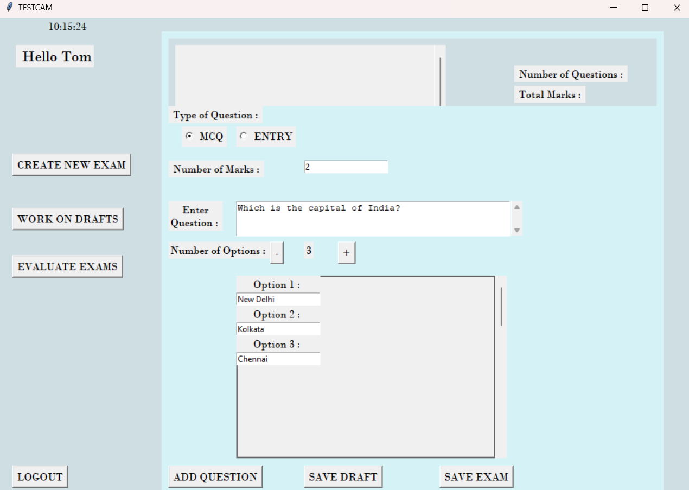
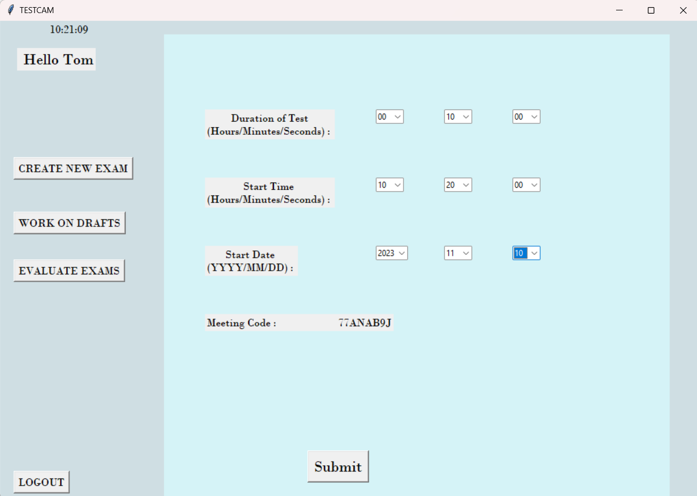
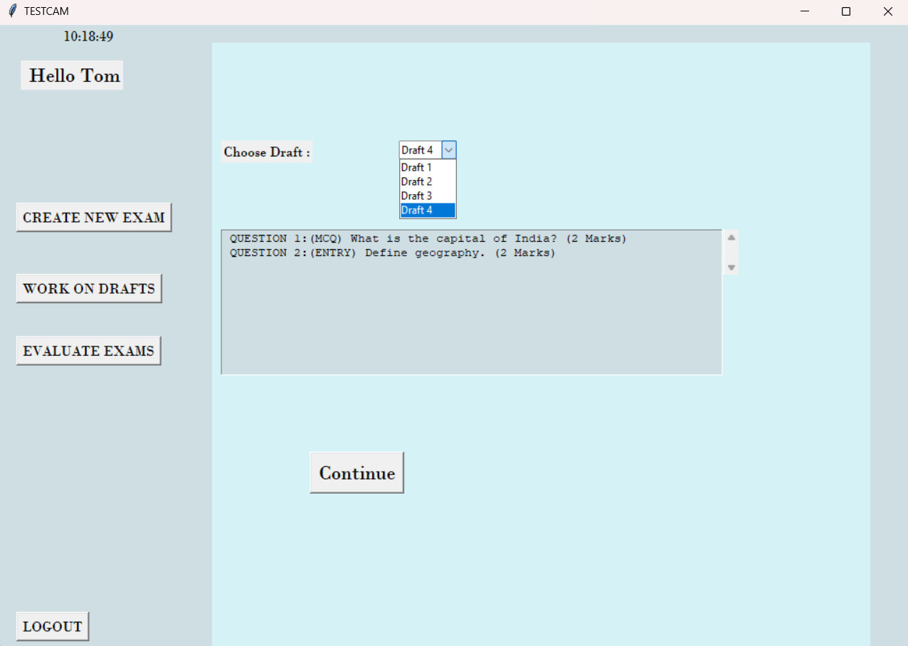
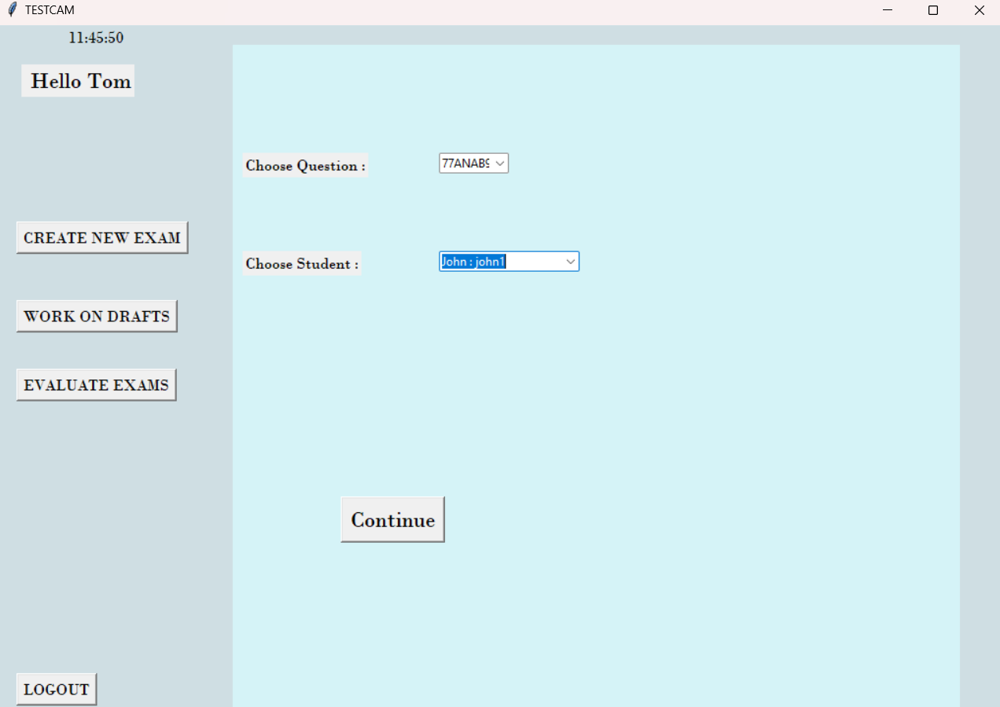
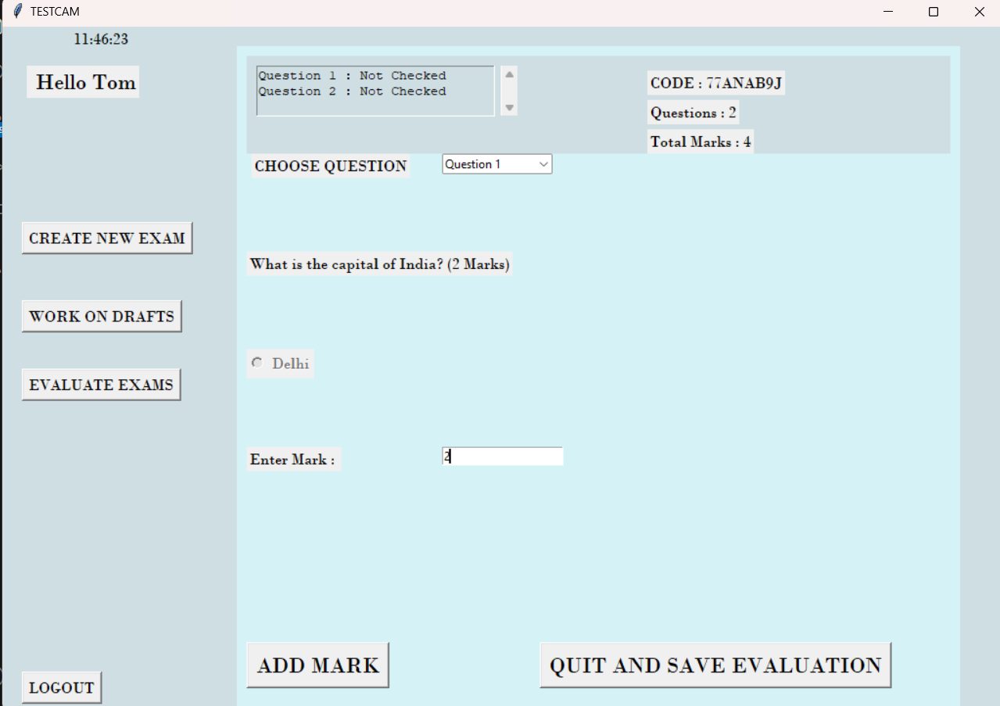
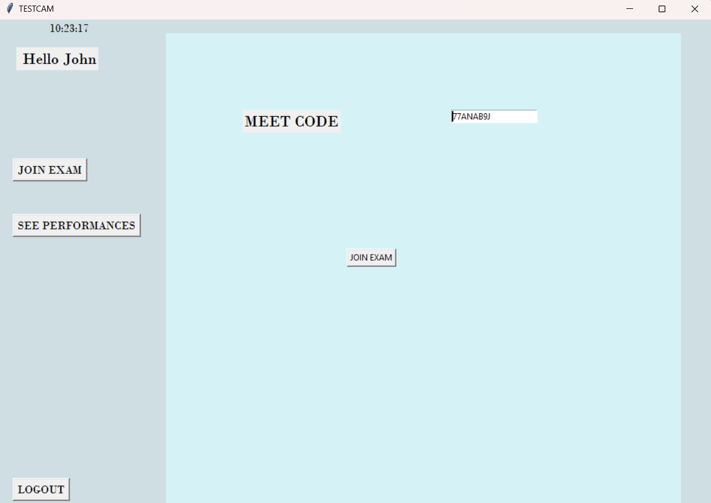
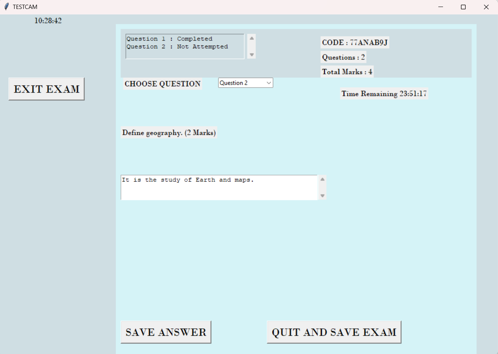
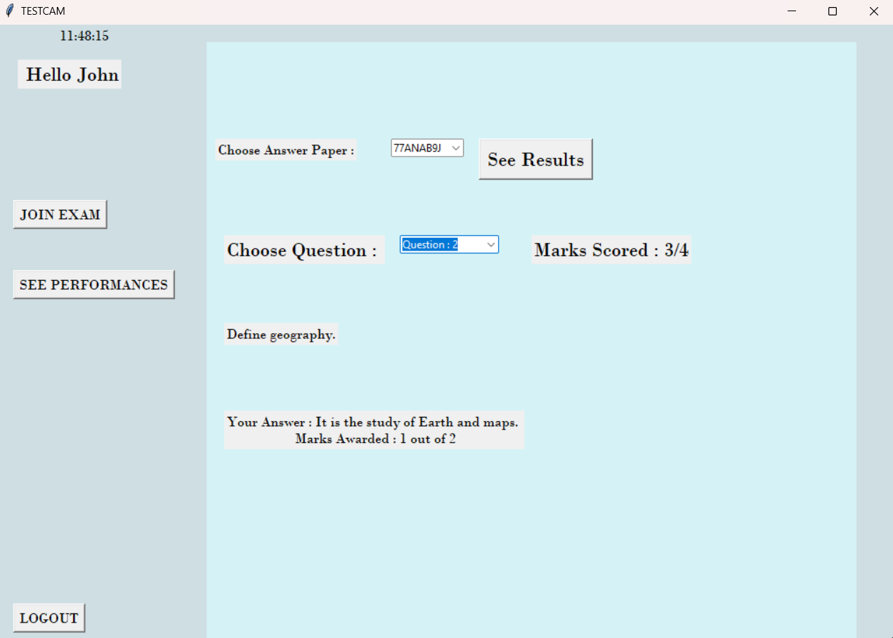

# miniproject_testcam
Testcam is an online Exam administration software written entirely in Python.

The aim of the project is to provide a simple platform for teachers 
to create question papers, evaluate them, and run these tests. On the other hand, students 
are able to attend the exam through the software and check their grades in previous tests.
The teacher and student functions are integrated into a simple Tkinter GUI with the data being stored
on an online SQL server, making data readily accessible to users anywhere.

*******************************************************************************************************************************************************
This is the look of the Landing Page and it acts as a platform for both teachers and students.
 

 
This is the registration of the Teacher and the student. The code lies in start.py. It accesses the local db(parametrized in start.py) and finds for stu and tea table.
 

 

 
## Features for Teachers ##
Teachers have options to :
  * Create New Exams
  * Work on Drafts
  * Evaluate Exams
### Teachers Creating Questions ###

 
The above is for creating MCQs with multiple options.
 

 
The above is for creating Entry Based Questions.

### Teachers Creating Exams ###

 
An Exam Code is generated that is not utilized in any of the pending exams.
 
### Teachers Working on Drafts ###

 
The drafts are stored locally on files and can be accessed from the last question added.
 
### Teacher Evaluating Answers ###

 
Teachers access the exam sheet by code and student by username and name, this is only allowed after the exam time is over.
 

 
Teachers access each question and enter marks for each of them, which can be later viewed by students.
 

## Features for Students ##
Students have options to :
  * Join an Exam
  * View Past Performances
  
### Join an Exam ###

 
Students can join exams with the help of an exam code that is generated for a teacher. 
 

 
Student is now seen attending the entry type of question here and can select a question by a dropdown, and view his progress at the top.

### View Past Performances ###

 
*******************************************************************************************************************************************************
#Modules
The start.py consists of functions to open up the main page that leads to Student Login/Student Registration/Teacher Login/Teacher Registration.

It consists of verify_reg() that does the verification of fields during registration of a user(like correct username to strong password).
It has verify_login() that retrieves student/teacher with same credentials as in Online DB.

*******************************************************************************************************************************************************

The student.py consists of functions enabling student to Join an Ongoing Live Exam or See The Results of Previous Evaluated Exams.

base_test() will open up the test if the correct Test Code is provided that is live in the Online DB(can be accessed by students).
runtest() covers functionalities to update completed questions, save drafts to a local file and commit these changes to db on completion of test. It also provides the 
time left for the completion of the test, by retrieving end time from DB.
prevtest() takes care of functionalities to retrieve record of previously evaluated answers for each question along with marks rewarded.

*******************************************************************************************************************************************************

The teacher.py consists of functions to Create New Exams, Work On Drafts and to Evaluate Exams.

The questions are either MCQ or Text Entry Based.
addq() adds a question and selects its type.
addoption(),removoption(), adds MCQ Options to each question.
save_e() leads to a page to select the start and end time for the Test, and also generates a unique Meeting Code.
save_d() saves the current exam as a text file on local machine that can be retrieved later.
on_submit_test() adds the test with question and options(for MCQ) to be commited into the DB. 
draftwork() opens previous drafts, allows us to correct the drafts, make changes to it  and continue with save_e()
evaluate() looks after retrieving completed answers from students (saved to Online DB) and assinging marks to each of their individual answers, updating their
marks to the database, that can be later viewed by students.

*******************************************************************************************************************************************************
